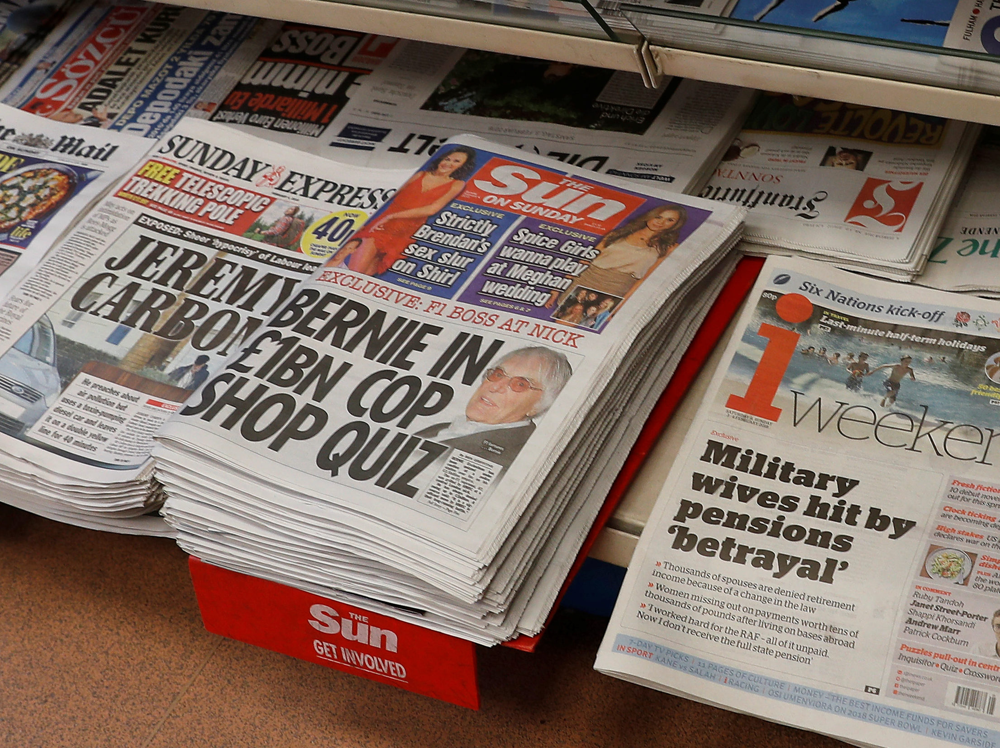

# Sitio Web con HTML5, CSS3 y JavaScript
Este es un sitio web usando HTML5, CSS3, JavaScript, con Flexbox, CSS Grid y ScrollReveal.

- [Sitio Web con HTML5, CSS3 y JavaScript](#sitio-web-con-html5-css3-y-javascript)
  - [Creación de archivos](#creaci%c3%b3n-de-archivos)
  - [Simulación](#simulaci%c3%b3n)
  - [Demo Sitio Web](#demo-sitio-web)

## Creación de archivos

1. Creamos los archivos _index.html_, _styles.css_ y _main.js_

<p align="center">

</p>

2. Instalaremos la extensión _Live Server_ en _Visual Studio Code_ para ejecutar el servidor web y poder observar nuestro proyecto.

<p align="center">

</p>

Para ejecutarlo primero presionamos _Ctrl + Shift + P_ luego en el buscador colocamos _live server_ y hacemos click en _Open Live Server_

<p align="center">

</p>
</br>
<p align="center">

</p>

3. Diseño de patrones

La página [https://www.heropatterns.com/](https://www.heropatterns.com/) me permite poder crear múltiples diseños de patrones.

<p align="center">

</p>

Copiar el patrón de diseño y pegar en el estilo para _body_ en el archivo _styles.css_

```css
body{
    background-image: url("data:image/svg+xml,%3Csvg xmlns='http://www.w3.org/2000/svg' width='80' height='105' viewBox='0 0 80 105'%3E%3Cg fill-rule='evenodd'%3E%3Cg id='death-star' fill='%23215ec1' fill-opacity='0.15'%3E%3Cpath d='M20 10a5 5 0 0 1 10 0v50a5 5 0 0 1-10 0V10zm15 35a5 5 0 0 1 10 0v50a5 5 0 0 1-10 0V45zM20 75a5 5 0 0 1 10 0v20a5 5 0 0 1-10 0V75zm30-65a5 5 0 0 1 10 0v50a5 5 0 0 1-10 0V10zm0 65a5 5 0 0 1 10 0v20a5 5 0 0 1-10 0V75zM35 10a5 5 0 0 1 10 0v20a5 5 0 0 1-10 0V10zM5 45a5 5 0 0 1 10 0v50a5 5 0 0 1-10 0V45zm0-35a5 5 0 0 1 10 0v20a5 5 0 0 1-10 0V10zm60 35a5 5 0 0 1 10 0v50a5 5 0 0 1-10 0V45zm0-35a5 5 0 0 1 10 0v20a5 5 0 0 1-10 0V10z' /%3E%3C/g%3E%3C/g%3E%3C/svg%3E");
}
```

4. En [https://fonts.google.com/](https://fonts.google.com/) escogemos una fuente para nuestra web. Seleccionamos la fueste que queremos crear y hacemos click en _Embed_ al lado derecho, copiamos el link y colocamos dentro de la etiqueta _head_ de nuestro _index.html_

<p align="center">

</p>

5. Dentro de _styles.css_ ocupamos la fuente de texto.

```css
body{
    font-family: 'Oswald', sans-serif;
}
```

6. Centramos todo el contenido

```css
.container{
    width: 90%;
    margin: auto;
}

```

7. Organizamos la navegación.

```css
/*Navigation*/
.nav-main{
    font-size: 17px;
    display: flex;
    justify-content: space-between; /*utilizan todo el ancho disponible*/
    align-items: center;
    height: 60px;
    padding: 20px 0;
}
```

8. Editar el menú de navegación.

```html
<nav class="nav-main">
            
            <ul class="nav-menu">
                <li>
                    <a href="#">Noticias</a>
                </li>
                <li>
                    <a href="#">Internacional</a>
                </li>
                <li>
                    <a href="#">América Latina</a>
                </li>
                <li>
                    <a href="#">Economía</a>
                </li>
                <li>
                    <a href="#">Tecnología</a>
                </li>
                <li>
                    <a href="#">Ciencia</a>
                </li>
                <li>
                    <a href="#">Salud</a>
                </li>
                <li>
                    <a href="#">Cultura</a>
                </li>
                <li>
                    <a href="#">Deportes</a>
                </li>
                <li>
                    <a href="#">Festivales</a>
                </li>
            </ul>
            <ul class="nav-menu-right">
                <li>
                    <a href="#">
                        <i class="fas fa-search"></i>
                    </a>
                </li>
            </ul>
        </nav>
        <hr>
```

9. Modificamos la imagen inicial.

```html
<!-- SHOWCASE-->
        <header class="showcase">
            <h2>Noticia principal del día</h2>
            <p>Lorem ipsum dolor sit amet consectetur adipisicing elit. Sed ratione consectetur debitis at officia, commodi perspiciatis placeat et provident magnam ipsum ut excepturi, nihil id tenetur eum fuga illum! Placeat.</p>
            <a href="#" class="btn">Leer más <i class="fas fa-angle-double-right"></i></a>
        </header>
```

```css
/*SHOWCASE*/
hr{
    margin: 10px 0;
}

.showcase{
    width: 100%;
    height: 550px;
    background: url('../images/background.jpg') no-repeat center center/cover;
    padding: 50px;
    margin-bottom: 20px;
    display: flex;
    flex-direction: column;
    align-items: center;
    justify-content: flex-end;
}

.btn{
    cursor: pointer;
    display: inline-block;
    border: 0;
    font-weight: bold;
    padding: 10px 20px;
    background: #272727;
    color: #fffffff1;
    font-size: 15px;
    border: 1px solid #fffffff1;
    margin: 10px 0;
}

.btn:hover{
    opacity: .7;
}

.showcase h2,
.showcase p{
    margin-bottom: 10px;
}

```

10. Modificamos la sección de noticias.

```html
<!--NEWS CARDS-->
        <div class="news-cards">
            <div>
                
                <h3>Lorem, ipsum dolor.</h3>
                <p>Lorem ipsum dolor sit, amet consectetur adipisicing elit. Molestias odit, et quis placeat iste voluptate?</p>
                <a href="#">Aprender más <i class="fas fa-angle-double-right"></i></a>
            </div>
            <div>
                
                <h3>Lorem, ipsum dolor.</h3>
                <p>Lorem ipsum dolor sit, amet consectetur adipisicing elit. Molestias odit, et quis placeat iste voluptate?</p>
                <a href="#">Aprender más <i class="fas fa-angle-double-right"></i></a>
            </div>
            <div>
                
                <h3>Lorem, ipsum dolor.</h3>
                <p>Lorem ipsum dolor sit, amet consectetur adipisicing elit. Molestias odit, et quis placeat iste voluptate?</p>
                <a href="#">Aprender más <i class="fas fa-angle-double-right"></i></a>
            </div>
            <div>
                
                <h3>Lorem, ipsum dolor.</h3>
                <p>Lorem ipsum dolor sit, amet consectetur adipisicing elit. Molestias odit, et quis placeat iste voluptate?</p>
                <a href="#">Aprender más <i class="fas fa-angle-double-right"></i></a>
            </div>
        </div>
```

```css
/*NEWS CARDS*/
.news-cards{
    display: grid;
    grid-template-columns:  repeat(4, 1fr); /*repite 4 veces*/
    gap: 25px; /*espaciado entre los elementos*/
    margin: 10px 0;
}

.news-cards img{
    width: 100%;
    height: 180px;
}

news-cards h3{
    font-size: 20px;
    margin: 10px 0;
}

.news-cards a{
    padding: 10px 0;
    color: #f2f2f2;
    text-transform: uppercase;
    display: inline-block;
    font-weight: bold;
}

.news-cards a:hover{
    text-decoration: underline;
}
```

11. Editamos el banner central.

```html
        <section class="cards-banner-one">
            <div class="content">
                <h2>Lorem, ipsum dolor.</h2>
                <p>Lorem ipsum dolor sit amet consectetur adipisicing elit. Sapiente rem nihil reiciendis ut beatae amet ratione fugit veritatis similique eveniet.</p>
                <a href="#" class="btn">Leer más <i class="fas fa-angle-double-right"></i></a>
            </div>
        </section>
```

```css
/*CARDS BANNER ONE*/
.cards-banner-one{
    width: 100%;
    height: 350px;
    background: url('../images/background_2.jpg');
    margin-bottom: 40px;
}

.cards-banner-one .content{
    width: 40%;
    padding: 90px 0 0 30px;
    color: #fffffff1;
}

.cards-banner-one p,
.cards-banner-one h2{
    margin: 10px 0 20px 0;
}
```

12. Copiamos la parte de _NEW CARDS_ nuevamente debajo.

```html
<!--NEWS CARDS-->
        <div class="news-cards">
            <div>
                
                <h3>Lorem, ipsum dolor.</h3>
                <p>Lorem ipsum dolor sit, amet consectetur adipisicing elit. Molestias odit, et quis placeat iste voluptate?</p>
                <a href="#">Aprender más <i class="fas fa-angle-double-right"></i></a>
            </div>
            <div>
                
                <h3>Lorem, ipsum dolor.</h3>
                <p>Lorem ipsum dolor sit, amet consectetur adipisicing elit. Molestias odit, et quis placeat iste voluptate?</p>
                <a href="#">Aprender más <i class="fas fa-angle-double-right"></i></a>
            </div>
            <div>
                
                <h3>Lorem, ipsum dolor.</h3>
                <p>Lorem ipsum dolor sit, amet consectetur adipisicing elit. Molestias odit, et quis placeat iste voluptate?</p>
                <a href="#">Aprender más <i class="fas fa-angle-double-right"></i></a>
            </div>
            <div>
                
                <h3>Lorem, ipsum dolor.</h3>
                <p>Lorem ipsum dolor sit, amet consectetur adipisicing elit. Molestias odit, et quis placeat iste voluptate?</p>
                <a href="#">Aprender más <i class="fas fa-angle-double-right"></i></a>
            </div>
        </div>
```

13. Creamos el segundo banner.

```html
        <section class="cards-banner-two">
            <div class="content">
                <h2>Lorem, ipsum dolor.</h2>
                <p>Lorem ipsum dolor sit amet consectetur adipisicing elit. Hic corporis unde ipsum aperiam excepturi, natus ipsam nulla error deleniti. Id amet sunt atque possimus laudantium.</p>
                <a href="#" class="btn">Leer más <i class="fas fa-angle-double-right"></i></a>
            </div>
        </section>
```

```css
/*CARDS BANNER TWO*/
.cards-banner-two{
    background: url('../images/background_3.jpg') no-repeat center center/cover;
    width: 100%;
    height: 350px;
}

.cards-banner-two .content{
    width: 50%;
    padding: 100px 0 0 30px;
    color: #fffffff1;
}
```

14. Modificar los enlaces sociales.


```html
        <section class="social">
            <p>Sigue a News</p>
            <div class="links">
                <a href="#">
                    <i class="fab fa-facebook"></i>
                </a>
                <a href="#">
                    <i class="fab fa-twitter"></i>
                </a>
                <a href="#">
                    <i class="fab fa-linkedin"></i>
                </a>
            </div>
        </section>
```

```css
/*SOCIAL*/
.social{
    margin: 50px;
}

.social p{
    text-align: center;
    font-size: 30px;
    margin-bottom: 20px;
}

.links{
    display: flex;
    align-items: center;
    justify-content: center;
}

.links a{
    margin: 0 30px;
}

.links a i{
    font-size: 3rem;
}
```

15. Editar el footer. Copiamos 4 columnas de la siguiente lista, además, modificamos su estilo css.


```html
<div class="footer-links">
        <div class="footer-container">
            <!-- copiar esta lista 4 veces-->
            <ul>
                <li>
                    <a href="#">
                        <h3>Título 1</h3>
                    </a>
                </li>
                <li>
                    <a href="#">Internacional</a>
                </li>
                <li>
                    <a href="#">América Latina</a>
                </li>
                <li>
                    <a href="#">Economía</a>
                </li>
                <li>
                    <a href="#">Tecnología</a>
                </li>
                <li>
                    <a href="#">Ciencia</a>
                </li>
                <li>
                    <a href="#">Salud</a>
                </li>
                <li>
                    <a href="#">Cultura</a>
                </li>
                <li>
                    <a href="#">Deportes</a>
                </li>
                <li>
                    <a href="#">Festivales</a>
                </li>
            </ul>
```

```css
/*FOOTER LINKS*/
.footer-links {
    background: #2f3642;
    color: #61616161;   
    font-size: 12px;
    padding: 35px 0;
}

.footer-container {
    display: grid;
    grid-template-columns: repeat(4, 1fr);
    gap: 10px;
    align-items: flex-start;
    justify-content: center;
}

.footer-container ul {
    margin: 0 auto;
}

.footer-container ul li {
    line-height: 2.5;
}
```

16. Editar el copyright del footer.

```html
<footer class="footer">
        <h3>News Copyright</h3>
    </footer>
```

```css
.footer {
    background: #2f3642;
    color: #9399a1;
    font-size: 12px;
    padding: 20px 0;
    text-align: center;
    padding-bottom: 20px;
}
```

17. Resposive Design.

```css
@media (max-width:700px) { /*para pantallas menores a 700px de ancho*/
   
    .nav-main ul.nav-menu {
        display: block;
        position: absolute; /*encima de todo*/
        top: 0; /*en la esquina*/
        left: 0; /*izquierda*/
        background: #2f3642;
        height: 100%;
        transform: translateX(-400px); /* quitar el espaciado se hará con javascript*/
        padding: 30px;
        opacity: .9;       
    }

    .nav-main ul.nav-menu li{
        padding: 20px;
        font-size: 14px;

    }

    .news-cards{
        grid-template-columns: repeat(2, 1fr); /* las columnas ahora serán de dos*/
    }

    .cards-banner-one .content,
    .cards-banner-two .content {    /*el contenido de los banner abarque ya no el 40% sino el 80%*/
        width: 80%;
    }

    .footer-links .footer-container{
        grid-template-columns: repeat(2, 1fr); /*solamente 2 columnas en vez de 4*/
    }
    
}

```
18. Creamos un botón que aparecerá para desplegar el menú de navegación. Lo colocamos dentro de _body_ arriba de todo el contenido.

```html
    <div class="menu-btn">
        <i class="fas fa-bars"></i>
    </div>
```

```css
.menu-btn{
    position: absolute;
    cursor: pointer;
    top: 15px;
    right: 30px;
    z-index: 2;
    font-size: 1.5rem; 
    display: none;   
}
```

19. Modificamos el estilo del botón creado para el _@media_

```css
.nav-main ul.nav-menu-right {
        margin: 40px;
    }
```

20. Crear el estilo que hará que se aparezca el munú lateral cuando tengo la clase _show_.

```css
.nav-main ul.nav-menu.show{
        transform: translateX(-20px);
    }
```

21. Agregamos un _script_ que especifique el archivo javascript que usaremos.

```html
<script src="./js/main.js"></script>
```

22. En el archivo de _javaScript_, _main.js_ agregamos el evento que aparecerá de desaparecerá el menú lateral.

```javascript
document.querySelector('.menu-btn').addEventListener('click',()=> {
    document.querySelector('.nav-menu').classList.toggle('show'); //aparece y desaparece el menú lateral
}
)
```
23. Colocamos el estilo para que aparezca el botón _menu-btn_ para pantallas menores a un ancho de 700px.

```css
@media (max-width:700px) { 
    
    .menu-btn{
        display: block;
    }

```

24. Usaremos __ScrollReveral__ que cargará los elementos cada vez que vayamos deslizando hacia abajo la página. Visitamos su [web oficial](https://scrollrevealjs.org/). Copiamos la CDN y pegamos al final de nuestra etiqueta _body_.

```html
<script src="https://unpkg.com/scrollreveal"></script>
```

25. Finalmente, agregar el código de javascript que irá cargando los contenidos.

```javascript
ScrollReveal().reveal('.showcase');
ScrollReveal().reveal('.news-cards', {delay: 500});
ScrollReveal().reveal('.cards-banner-one', {delay: 500});
ScrollReveal().reveal('.cards-banner-two', {delay: 500});
```

## Simulación

__Simulación tamaño normal__
<p align="center">

</p>

__Simulación tamaño máximo de 700px__
<p align="center">

</p>

__Simulación tamaño máximo de 500px__
<p align="center">

</p>


## Demo Sitio Web

[Sitio Web](https://diegodavidq.github.io/NewsPage/)
