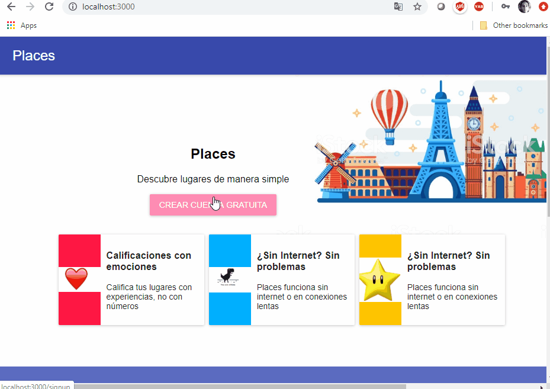
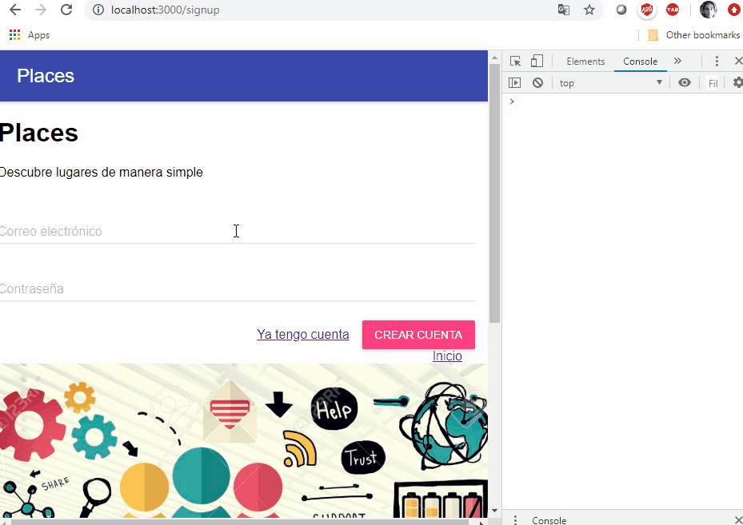

# Página Web Simple con React

* Conexión con un [servidor Node.js](https://github.com/diegodavidQ/diegodavidq.github.io/tree/master/nodeServerPageReact)
* Conexión con Cloudinary para subir imágenes
* Uso de mongodb como base de datos.

## Ejecución

Dentro de la carpeta del proyecto SimplePageReact. Este proyecto se ejecuta en el puerto 3000. 

1. npm install
2. mpm start
3. ingresar a la dirección: [localhost:3000](localhost:3000)
4. Ejecutar el [servidor Node.js](https://github.com/diegodavidQ/diegodavidq.github.io/tree/master/nodeServerPageReact)

## Demo página de inicio

## Demo Create Account

## Demo Login

## Demo Places

